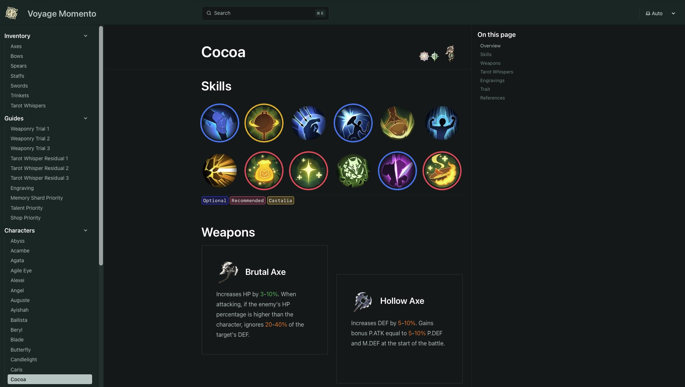
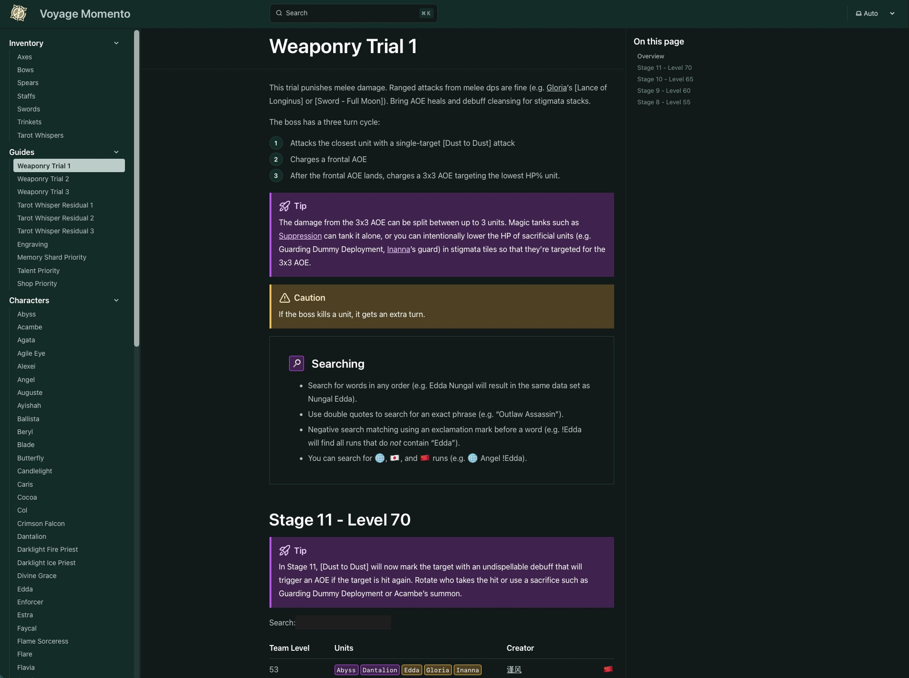

#  Voyage Momento

**[Voyage Momento](https://voyagemomento.com)** is a comprehensive, distilled guide and wiki for the tactical RPG *Sword of Convallaria*. Built using [Astro](https://astro.build/) and [Starlight](https://starlight.astro.build/), the project aims to help players optimize their journey by providing clear, accessible information on characters, inventory, weapons, tarot whispers, and gameplay strategies.

Check out the live site at: **[https://voyagemomento.com](https://voyagemomento.com)**

## 📸 Screenshots & Visuals

### Character Guides
Detailed analysis and optimal builds for each character.


### Content Guides


### Features
- **Character Database**: Full roster details, including stats, skills, and tier insights.
- **Inventory & Weapons**: Extensive information on Axes, Bows, Spears, Staffs, Swords, and Trinkets.
- **Comprehensive Guides**: Strategies for Weaponry Trials, Tarot Whispers, Engraving, Memory Shard Priorities, and more.
- **Fast & Responsive**: Built with Astro + Tailwind for a blazing-fast, mobile-friendly user experience.

---

## 🚀 How to Run Locally

If you'd like to run Voyage Momento locally or contribute to the project, follow these steps:

### Prerequisites
Make sure you have Node.js installed (the project uses Node `23.10.0` as specified in `.mise.toml`).

### 1. Clone the repository
```bash
git clone https://github.com/chongfun/voyage-momento.git
cd voyage-momento
```

### 2. Install dependencies
Run the following command in the root of the project to install all required packages:
```bash
npm install
```

### 3. Start the local development server
```bash
npm run dev
```
This will start the local development server, typically at `http://localhost:4321`.

### 4. Build for production
To build the static site for production deployment:
```bash
npm run build
```
The output will be generated in the `./dist/` directory. You can preview the production build using:
```bash
npm run preview
```

---

## 🧞 Project Structure

The project follows a standard Astro + Starlight structure:

```text
.
├── public/                 # Static assets (favicons, manifests, etc.)
├── src/
│   ├── assets/             # Images, logos, and UI graphics
│   ├── components/         # Custom Astro components (e.g., PageTitle)
│   ├── content/
│   │   └── docs/           # Markdown & MDX content (the actual wiki pages)
│   ├── styles/             # Custom CSS and Tailwind styles
│   └── tailwind.css        # Base Tailwind entry
├── astro.config.mjs        # Main Astro configuration (integrations, sidebar setup)
└── package.json            # Scripts and dependencies
```

All content routes are dynamically generated based on the file names inside the `src/content/docs/` directory.

---

## 🛠️ Tech Stack

- **Framework**: [Astro](https://astro.build/)
- **Documentation Theme**: [Starlight](https://starlight.astro.build/)
- **Styling**: [Tailwind CSS](https://tailwindcss.com/)
- **Analytics**: Google Analytics
